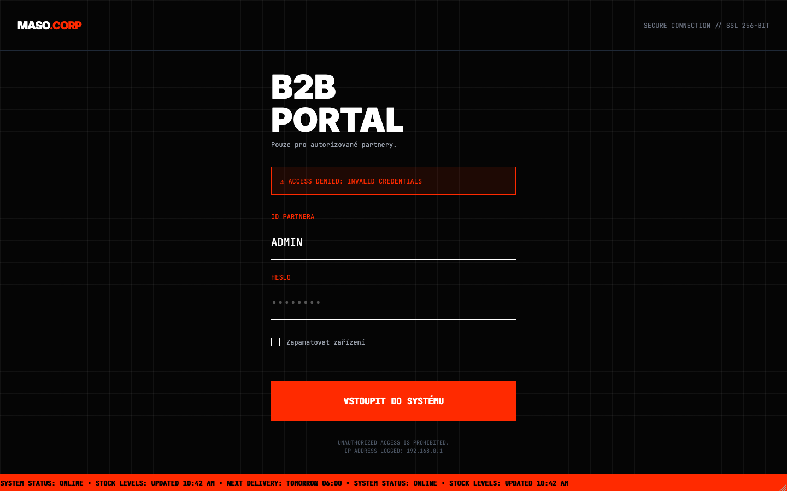
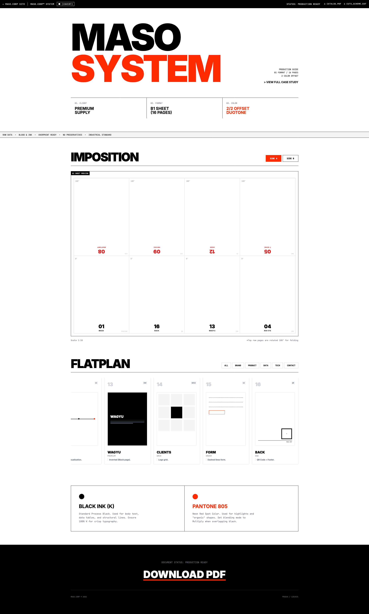

# MASO.CORP // INDUSTRIAL SUPPLY

A speculative design project exploring the aesthetics of corporate brutalism applied to a fictional high-tech meat processing conglomerate.

Beyond the visual facade, this project features a **fully functional Print Production Tool** (Offset Imposition & Flatplan Renderer), demonstrating the fusion of graphic design rules with frontend logic.

🔗 **[View Live Terminal](https://yunglordsimens.github.io/maso.corp/)**

---

### / SYSTEM PREVIEW

> **System Access & Dashboard.** Simulating a restricted B2B environment with IP logging and strict validation.
 

---

### / CONCEPT & NARRATIVE

The project imagines a near-future interface for **MASO.CORP**, a ubiquitous meat supply monopoly. The design language rejects consumer-friendly warmth in favor of "Anti-Design" and "Raw Industrialism."

**Visual & Technical Pillars:**
* **Aesthetic:** Corporate Brutalism. High contrast, monospace typography (`JetBrains Mono`), and raw layout grids.
* **Design Engineering:** The system includes a hidden **"Technical Guide" module** — a custom-coded tool that automatically renders print impositions and flatplans using `Chart.js`, simulating real-world offset printing workflows.
* **Atmosphere:** Dystopian B2B. Interface elements simulate system logs, stock tickers, and unauthorized access warnings.

---

### / INTERFACE MODULES

The prototype consists of several interconnected system nodes:

<table style="border: none; width: 100%;">
  <tr>
    <td width="50%" valign="top">
      <h4 align="center">B2B LOGIN GATE</h4>
      
Simulated security protocols & IP tracking.

      
    </td>
    <td width="50%" valign="top">
      <h4 align="center">ERROR HANDLING (404)</h4>
      
CRT Scanline effects & Noise overlays.

      
    </td>
  </tr>
  <tr>
    <td colspan="2" valign="top">
      <h4 align="center">TECHNICAL STYLEGUIDE</h4>
      
Automated flatplan renderer & imposition viewer for print materials.

      
    </td>
  </tr>
</table>

### / TECH IMPLEMENTATION

Built as a lightweight, performance-focused static site using utility-first principles.

| Technology | Usage |
| :--- | :--- |
| **HTML5** | Semantic structure for dashboard layouts. |
| **Tailwind CSS** | Utility-first styling for rapid UI prototyping and dark mode handling. |
| **Vanilla JS** | Logic for interactive cursors, image reveals, and style toggles. |
| **Chart.js** | Data visualization for the technical guide dashboard. |

### / CREDITS

**Maria Chernobay** — Art Direction & Frontend Development.
*Concept Work, 2025.*
